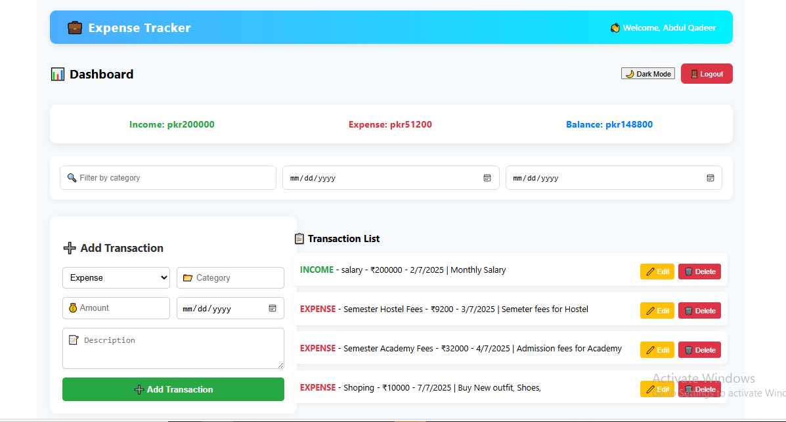
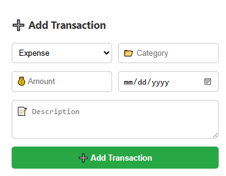
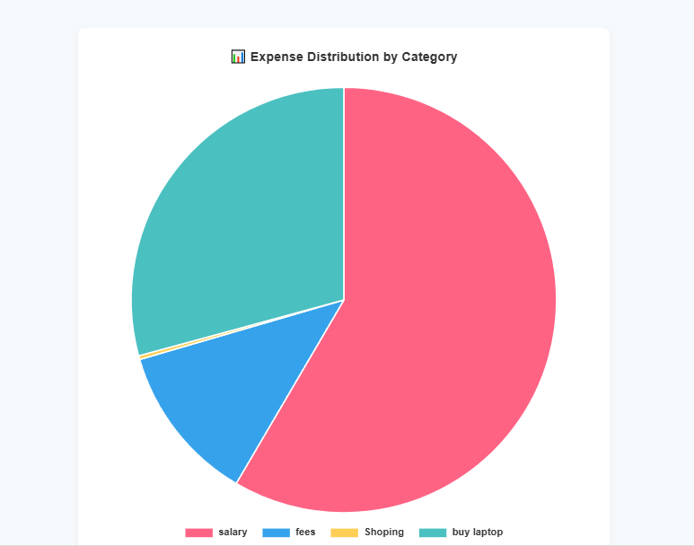

# 💸 Expense Tracker App

A full-featured and beautifully designed **Expense Tracker Web App** built using the **MERN Stack (MongoDB, Express, React, Node.js)**. It helps users track income and expenses with visual insights, filters, authentication, and budget planning.

---

## 🚀 Features

### 🔐 Authentication
- Secure Register/Login (JWT)
- Password Hashing with Bcrypt
- Role-based access (optional)

### 💰 Transaction Management
- Add, Edit, Delete Income/Expenses
- Categorize (Food, Rent, Salary...)
- Mark recurring, essential/non-essential

### 📊 Analytics & Charts
- Income vs Expense Pie Chart
- Monthly Expense Trends (Bar/Line)
- Category-wise Breakdown

### 🔎 Smart Filters & Search
- Filter by Category, Date, Type
- Search by Description or Title

### 💳 Budget Planning
- Set Monthly/Weekly Budgets
- Alert on Budget Limits

### 🌗 Theme Support
- Light/Dark Mode Toggle

### ☁️ Data Persistence
- MongoDB Cloud (Atlas)
- REST APIs

### 📤 Export (Coming Soon)
- Export CSV/PDF Files

---

## 🖼️ Demo Screenshots

> Place the images in: `client/public/images/`

| Dashboard | Add Transaction | Analytics | Dark Mode |
|-----------|------------------|-----------|-----------|
|  |  |  |

---

## 🧰 Tech Stack

| Frontend         | Backend          | Database     | Authentication |
|------------------|------------------|--------------|----------------|
| React + Axios    | Node.js + Express| MongoDB Atlas| JWT + Bcrypt   |

---

## 🛠️ Installation & Setup Guide

### 1️⃣ Clone the Repo

```bash
git clone https://github.com/your-username/expense-tracker.git
cd expense-tracker
